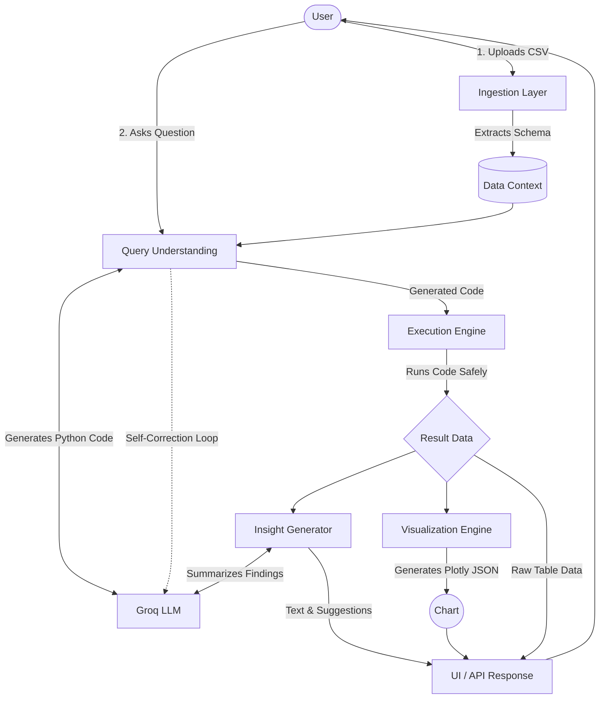

# 🤖 AI Data Analyst

AI Data Analyst is a full-stack, intelligent data analysis tool that allows users to upload CSV datasets and ask natural language questions to gain instant insights. 

Powered by **Groq**, **FastAPI**, **Streamlit**, and **Pandas**, this application translates plain English into executable Python code, runs it safely, and returns rich statistical insights alongside interactive Plotly visualizations.

---

## 🏗️ System Architecture & Data Flow



---

## ✨ Key Features

* **Natural Language to Code:** Translates user questions into Pandas manipulation code using high-speed LLMs (defaulting to `openai/gpt-oss-120b`).
* **Safe Code Execution:** Features a secure, sandboxed execution engine with pre-loaded standard data science libraries (NumPy, SciPy, Scikit-Learn) and dynamic auto-installation of missing packages.
* **Auto-Healing Execution:** If the generated code fails, the engine feeds the error back to the LLM for automatic self-correction and retries.
* **Smart Visualizations:** Intent-based routing automatically selects the perfect Plotly chart for your query (e.g., Box plots for outliers, Heatmaps for correlations, Line charts for trends).
* **Dynamic Insights:** Generates context-aware, textual explanations of the data results and provides smart follow-up question suggestions based on conversation history.
* **Robust Ingestion:** Automatically detects CSV delimiters, handles varied file sizes (up to 10MB default), cleans common data types, and extracts schema context.
* **Dual Interface:** Comes with a headless REST API (FastAPI) and a rich, interactive chat UI (Streamlit).

---

## 🛠️ Tech Stack

* **Backend API:** FastAPI, Uvicorn
* **Frontend UI:** Streamlit
* **Data Processing:** Pandas, NumPy, Scikit-Learn, SciPy
* **Visualization:** Plotly
* **Configuration:** Pydantic Settings
* **LLM Provider:** Groq API

---

## 📂 Project Structure

```text
ai_data_analyst/
├── .env                          # Environment variables
├── .gitignore                    # Git ignore file
├── README.md                     # Project Documentation
├── requirements.txt              # Project dependencies
├── setup.py                      # Packaging configuration
│
├── src/
│   └── ai_analyst/
│       ├── main.py               # API Server Entry Point
│       ├── api/                  # FastAPI layer (routes.py)
│       ├── config/               # Pydantic settings & Env loading (settings.py)
│       ├── core/                 # Business Logic
│       │   ├── ingestion.py             # CSV reading & schema extraction
│       │   ├── query_understanding.py   # LLM code generation & self-correction
│       │   ├── execution_engine.py      # Safe code execution & auto-installs
│       │   ├── insights.py              # Textual insight generation & next-steps
│       │   └── visualization.py         # Intent-based Plotly generation
│       ├── models/               # Data Models (Schemas & Context)
│       ├── ui/
│       │   └── app.py            # Streamlit Chat Interface
│       └── utils/                # Custom Exceptions & Centralized Logging
│
├── tests/
│   └── unit/
│       └── test_core.py          # Pytest suite for core logic
│
├── data/uploads/                 # Temporary storage for uploaded files
└── logs/                         # Application log files (app.log)
```

---

## 🚀 Installation & Setup

**1. Clone the repository**
```bash
git clone https://github.com/VenkateshHJoshi/ai_data_analyst.git
cd ai_data_analyst
```

**2. Create and activate a virtual environment**
```bash
# On macOS/Linux
python -m venv venv
source venv/bin/activate

# On Windows
python -m venv venv
venv\Scripts\activate
```

**3. Install dependencies**
```bash
pip install -r requirements.txt
```

**4. Set up Environment Variables**
Create a `.env` file in the root directory. The application relies on Pydantic to validate these settings:
```env
# Required
GROQ_API_KEY=gsk_your_groq_api_key_here

# Optional / Defaults
APP_NAME="AI Data Analyst"
APP_VERSION="1.0.0"
DEBUG=False
LOG_LEVEL=INFO
DEFAULT_MODEL=openai/gpt-oss-120b
TEMPERATURE=0.1
MAX_TOKENS=1024
HOST=0.0.0.0
PORT=8000
MAX_UPLOAD_SIZE_MB=10
```

---

## 💻 Running the Application

You can run the application in two ways: via the interactive UI or as a headless API.

### Option A: Run the Streamlit UI (Recommended for Users)
The Streamlit app provides a ChatGPT-like interface for uploading data and chatting with the AI.
```bash
streamlit run src/ai_analyst/ui/app.py
```
*Navigate to `http://localhost:8501` in your browser.*

### Option B: Run the FastAPI Backend (For Developers)
Start the RESTful API server to integrate the AI Analyst into other applications.
```bash
python -m src.ai_analyst.main
# OR
uvicorn src.ai_analyst.api.routes:app --host 0.0.0.0 --port 8000 --reload
```
*Navigate to `http://localhost:8000/docs` to view the interactive Swagger API documentation.*

---

## 🔌 API Endpoints (FastAPI)

If running the backend server, the following core endpoints are available:

* **`GET /`** - Health check.
* **`POST /upload`** - Upload a CSV file (Max 10MB). Returns the detected schema and row count.
* **`POST /query`** - Submit a natural language query (e.g., `{"query": "Show me the outliers in revenue"}`). Returns the generated insight, tabular data, and Plotly chart JSON.

---

## 🧪 Testing

The project includes a `pytest` suite covering ingestion, execution, and visualization logic. To run the tests:
```bash
pytest tests/
```

---

## ⚠️ Important Notes
* **Data Privacy:** The application executes code locally on the host machine. Only the column schema, query, and high-level statistical summaries are sent to the LLM. Your raw dataset is never uploaded to the LLM provider.
* **Destructive Operations:** The UI includes regex-based safety checks. If a query drops or filters rows, it displays a warning banner and provides a "Restore Original Dataset" button to revert the dataset to its original state.